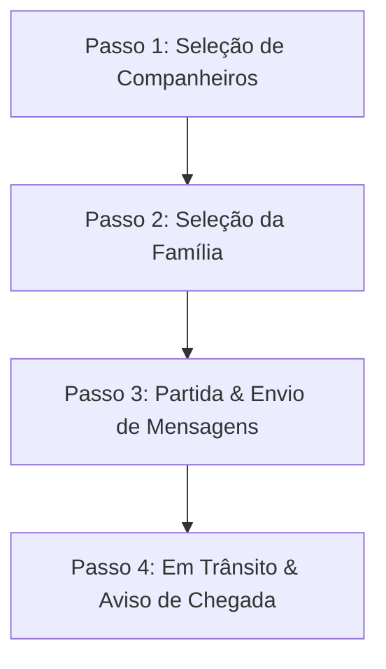

# Planejamento - Simulador de Visita (SPA)

Este documento registra os requisitos, fluxos de funcionamento e decisões de design para o desenvolvimento do **Simulador de Visita**. Este simulador será construído como uma aplicação de página única (SPA) para testar a ergonomia de coleta de dados e navegação em campo por vicentinos.

---

## 🔒 Diretrizes de Privacidade e Segurança (LGPD)

Como o teste é público, adotaremos uma política estrita de privacidade:
* **Entrada de Dados Manual**: Todos os nomes de vicentinos, famílias assistidas e relatos serão inseridos manualmente na hora do teste.
* **Sem Persistência Pública**: Os dados digitados existirão apenas na memória temporária do navegador do aparelho (ou no `localStorage` local do celular de teste) e **nunca** serão enviados a servidores, planilhas públicas ou bancos de dados em nuvem.
* **Aviso de Privacidade**: Exibiremos um alerta visual em destaque na tela inicial informando que nenhuma informação pessoal sensível é guardada ou transmitida.

---

## 📱 Regras de UX e Acessibilidade (Android & iOS)

A interface herdará as diretrizes de compatibilidade multiplataforma do laboratório:
* **Inputs com Fonte Mínima de 16px**: Para impedir que o Safari (iPhone) dê o zoom indesejado ao focar nos campos.
* **Área de Toque Generosa (min-height: 44px)**: Para todos os botões e links de navegação.
* **Respeito às Safe Areas**: Garantir espaçamento adequado caso o simulador utilize barras de ações coladas no topo ou rodapé.
* **Padrão de Cores de Ação (Acessibilidade 60+)**:
  * **Salvar / Avançar**: Fundo Verde, texto branco (sem ícones).
  * **Cancelar / Voltar**: Fundo Amarelo, texto escuro (sem ícones).
  * **Excluir / Limpar**: Fundo Vermelho, texto branco (sem ícones).

---

## 🛠️ Estrutura do SPA (Single Page Application - Wizard de Passos)

Para evitar sobrecarga cognitiva no usuário idoso, o simulador será estruturado como um **fluxo guiado (Wizard)** dividido em 4 etapas lineares:

### 🚗 Detalhamento dos Passos:

#### Passo 1: Seleção de Companheiros Vicentinos (Cadastro Opcional)
* **Objetivo**: Escolher quais vicentinos vão de carro junto com o motorista.
* **Componentes**:
  * Lista de vicentinos pré-cadastrados (com dados de simulação fictícios: Nome, Telefone e Endereço).
  * Formulário de cadastro rápido para adicionar/editar dados de teste reais.
  * Checkboxes grandes de seleção (pode-se selecionar nenhum, um ou vários companheiros).

#### Passo 2: Seleção da Família
* **Objetivo**: Definir a família assistida a ser visitada.
* **Componentes**:
  * Lista de famílias pré-cadastradas para agilizar testes.
  * Formulário de cadastro de nova família (Nome da Família, Telefone de WhatsApp e Endereço).

#### Passo 3: Partida (Iniciar Visita)
* **Objetivo**: Enviar as mensagens de partida e abrir a rota de navegação.
* **Componentes**:
  * Input de texto com a mensagem de saída editável (padrão: *"Estou saindo de casa para nossa visita!"*).
  * Botões sequenciais de WhatsApp para envio manual um por um:
    * `[ Enviar WhatsApp para Vicentino A ]`
    * `[ Enviar WhatsApp para Vicentino B ]`
    * `[ Enviar WhatsApp para Família Santos ]`
  * Destaque com dica de usabilidade: *"O WhatsApp foi aberto! Envie a mensagem lá e, depois, use o botão de 'Voltar' do seu celular para continuar aqui."*
  * Botão de Rota: `[ Iniciar Rota no Google Maps ]`. Abre a rota no Google Maps nativo contendo a origem (Local Atual), waypoints (casas dos vicentinos) e o destino final (casa da família).

#### Passo 4: Em Trânsito (Simulação de Chegada)
* **Objetivo**: Registrar o trajeto e avisar a família sobre a proximidade do carro.
* **Componentes**:
  * Status da rota ativa: *"Rota em andamento para a casa da Família..."*.
  * Botão grande amarelo: `[ Avisar Chegada (Enviar WhatsApp) ]` que abre o WhatsApp da família com o texto *"Estamos chegando!"*.

---

## 📝 Detalhes de Funcionamento e Regras de Negócio

1. **Geração de Deep Link do Maps**:
   * O link de rota é montado dinamicamente:
     `https://www.google.com/maps/dir/?api=1&origin=My+Location&destination=EnderecoFamilia&waypoints=EnderecoVic1|EnderecoVic2`
2. **Volta Inteligente (Atrito Cognitivo)**:
   * Sempre que o usuário clica em enviar mensagem de WhatsApp, o simulador abre uma tela de orientação visual explicando ao idoso que ele deve usar o botão físico "Voltar" do aparelho (Android) ou o link no topo esquerdo da tela (iOS) para retornar ao simulador e avançar de etapa.
